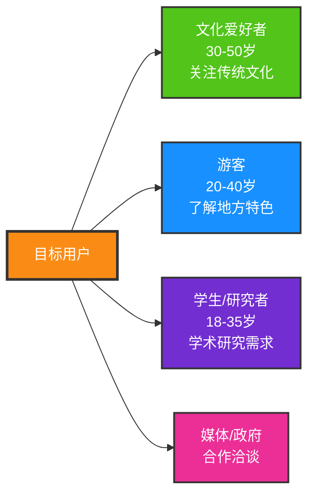
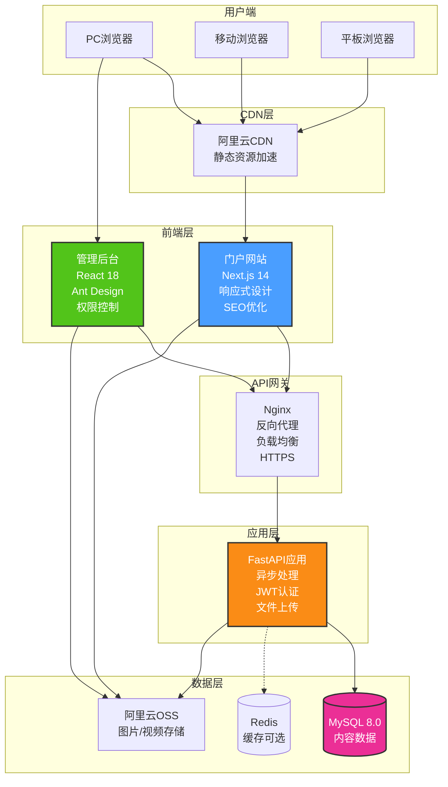
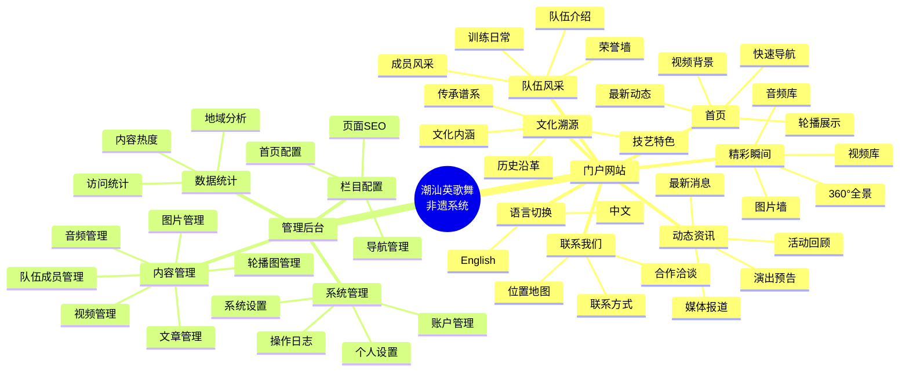
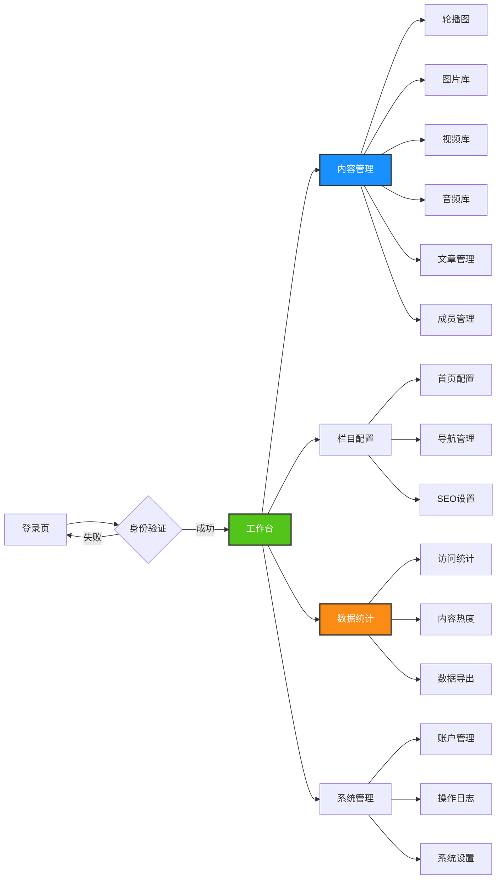
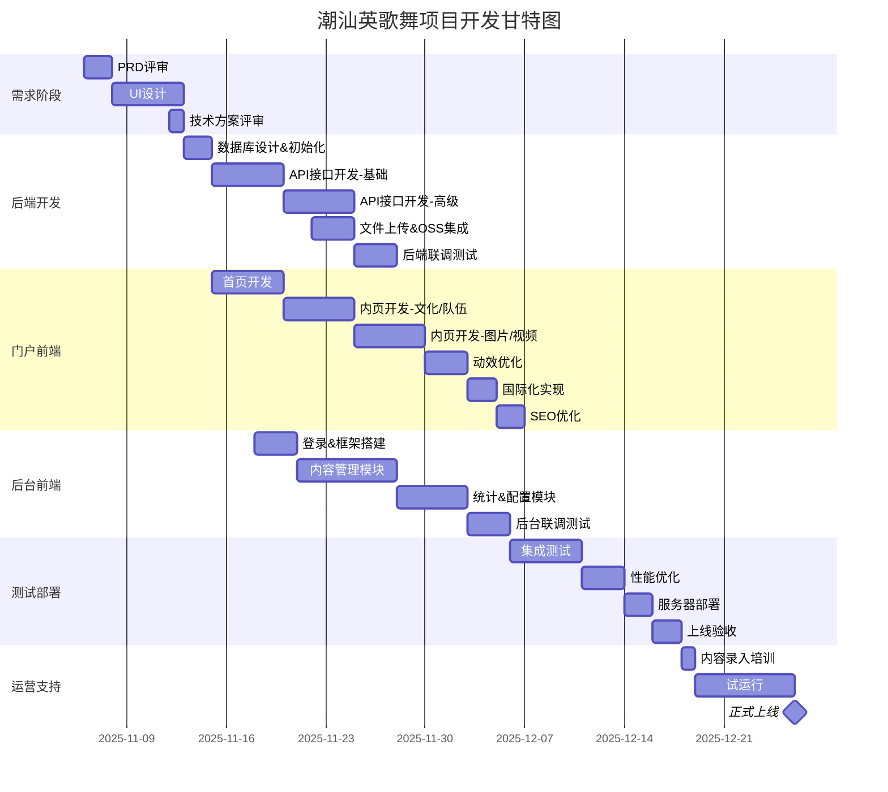

# 潮汕英歌舞非遗文化展示系统 PRD

## 📋 文档信息

| 项目名称 | 潮汕英歌舞非遗文化展示系统 |
|---------|--------------------------|
| 文档版本 | v1.0 |
| 创建日期 | 2025-11-06 |
| 项目类型 | 文化展示门户 + 内容管理后台 |
| 目标用户 | 大众用户（游客、文化爱好者） |

---

## 🎯 项目概述

### 项目背景
潮汕英歌舞作为国家级非物质文化遗产，需要一个现代化的数字平台来展示其独特魅力，传播非遗文化，让更多人了解和关注这一传统艺术。

### 项目目标
1. 打造一个视觉冲击力强、设计感十足的非遗文化展示门户
2. 提供便捷的内容管理后台，支持动态更新展示内容
3. 支持中英双语，面向全球推广潮汕文化
4. 通过数据统计了解访问情况，优化运营策略

### 核心价值
- **文化传播**：数字化展示非遗文化，扩大影响力
- **品牌建设**：提升队伍形象和知名度
- **运营便捷**：后台自主管理，无需技术人员
- **数据驱动**：访问数据分析，了解用户兴趣

---

## 👥 用户画像

### 主要用户群体



### 管理员用户
- **超级管理员**：1人，全部权限
- **内容管理员**：1-3人，内容发布权限（可选）

---

## 🏗️ 系统架构

### 整体架构图



### 技术栈明细

#### 前端技术栈

```yaml
门户网站:
  框架: Next.js 14 (App Router)
  语言: TypeScript
  UI基础: Tailwind CSS
  组件库: Shadcn/ui (高度定制)
  动效库:
    - Framer Motion (页面动画、组件动效)
    - GSAP (复杂动画、时间轴控制)
    - Lottie (动画资源)
  国际化: next-i18next
  HTTP: Axios
  SEO: next-seo
  图片优化: next/image
  视频播放: React Player
  特色功能:
    - 视差滚动 (React Scroll Parallax)
    - 3D效果 (Three.js / React Three Fiber)
    - 粒子效果 (tsParticles)

管理后台:
  框架: React 18 + Vite
  语言: TypeScript
  UI库: Ant Design 5.x
  路由: React Router v6
  状态管理: Zustand
  HTTP: Axios
  图表: Apache ECharts
  富文本: Quill / TinyMCE
  图片裁剪: React Cropper
  文件上传: Ant Design Upload
```

#### 后端技术栈

```yaml
核心框架:
  语言: Python 3.11+
  Web框架: FastAPI 0.104+
  ASGI服务器: Uvicorn
  
数据库:
  关系型数据库: MySQL 8.0
  ORM: SQLAlchemy 2.0
  数据迁移: Alembic
  异步驱动: aiomysql
  
缓存(可选):
  Redis: redis-py (异步)
  
认证授权:
  JWT: PyJWT
  密码加密: passlib + bcrypt
  
文件处理:
  上传: python-multipart
  图片处理: Pillow
  视频处理: ffmpeg-python
  
存储:
  对象存储: 阿里云OSS SDK (oss2)
  
工具库:
  配置管理: pydantic-settings
  日期处理: python-dateutil
  数据验证: Pydantic
  日志: loguru
  
开发工具:
  代码格式化: black, isort
  类型检查: mypy
  测试: pytest
```

#### 部署运维

```yaml
容器化:
  Docker: 应用容器化
  Docker Compose: 本地开发环境
  
Web服务器:
  反向代理: Nginx 1.24+
  HTTPS: Let's Encrypt (certbot)
  
服务器:
  云服务商: 阿里云 / 腾讯云
  操作系统: Ubuntu 22.04 LTS
  最低配置: 2核4G (初期)
  推荐配置: 4核8G (扩展)
  
CI/CD (可选):
  代码托管: Git (Gitee / GitHub)
  自动部署: GitHub Actions / 手动部署
  
监控 (可选):
  应用监控: Sentry
  服务器监控: 云监控
```

---

## 📱 功能架构

### 功能模块总览



---

## 🎨 门户网站详细设计

### 页面结构

#### 1. 首页 (Home)

**设计理念**：视觉冲击 + 快速导航

**布局结构**：
```
┌─────────────────────────────────────┐
│  顶部导航 (固定悬浮)                 │
├─────────────────────────────────────┤
│                                     │
│  全屏视频背景 / 动态轮播            │
│  + 标题动画 + CTA按钮               │
│  (呼吸光效、粒子特效)               │
│                                     │
├─────────────────────────────────────┤
│  快速导航卡片 (4-6个)               │
│  (悬停放大、阴影变化)               │
├─────────────────────────────────────┤
│  最新动态 (横向滚动)                │
├─────────────────────────────────────┤
│  数字展示 (计数动画)                │
│  成立年份 | 成员数 | 演出场次       │
├─────────────────────────────────────┤
│  底部 Footer                        │
└─────────────────────────────────────┘
```

**核心动效**：
- Hero区域视频背景自动播放（静音）
- 标题文字逐字淡入动画
- CTA按钮脉搏式呼吸光晕（每1.5秒一次）
- 滚动时视差效果（背景速度 < 内容速度）
- 导航卡片悬停时3D倾斜效果
- 数字滚动计数动画

**多语言**：
- 顶部语言切换按钮（中/EN）
- 切换时平滑过渡，无刷新

---

#### 2. 文化溯源 (Culture)

**设计理念**：时间轴叙事 + 沉浸式阅读

**布局结构**：
```
┌─────────────────────────────────────┐
│  页面标题 + 面包屑导航              │
├─────────────────────────────────────┤
│  顶部大图 (视差滚动)                │
├─────────────────────────────────────┤
│  历史沿革 - 垂直时间轴              │
│  ○ 年份1 - 图文内容                │
│  │                                  │
│  ○ 年份2 - 图文内容                │
│  │                                  │
│  ○ 年份3 - 图文内容                │
├─────────────────────────────────────┤
│  文化内涵 - 卡片网格                │
│  ┌──────┐ ┌──────┐ ┌──────┐        │
│  │图标1 │ │图标2 │ │图标3 │        │
│  └──────┘ └──────┘ └──────┘        │
├─────────────────────────────────────┤
│  技艺特色 - 图文穿插                │
├─────────────────────────────────────┤
│  传承谱系 - 树状图                  │
└─────────────────────────────────────┘
```

**核心动效**：
- 滚动到时间轴节点时，节点从透明到实心动画
- 内容区域从左/右滑入淡现
- 卡片悬停时轻微上浮 + 阴影加深
- 传承谱系SVG线条绘制动画

---

#### 3. 队伍风采 (Team)

**设计理念**：人物聚焦 + 荣誉展示

**布局结构**：
```
┌─────────────────────────────────────┐
│  队伍整体介绍 (大图+文字)           │
├─────────────────────────────────────┤
│  成员墙 (网格布局)                  │
│  ┌────┐ ┌────┐ ┌────┐ ┌────┐       │
│  │头像│ │头像│ │头像│ │头像│       │
│  │姓名│ │姓名│ │姓名│ │姓名│       │
│  │职位│ │职位│ │职位│ │职位│       │
│  └────┘ └────┘ └────┘ └────┘       │
│  (点击弹出详细信息)                 │
├─────────────────────────────────────┤
│  训练日常 (视频/图片混排)           │
├─────────────────────────────────────┤
│  荣誉墙 (奖杯图标 + 滚动列表)       │
└─────────────────────────────────────┘
```

**核心动效**：
- 成员卡片悬停时头像放大、背景模糊
- 点击弹出Modal，内容从下向上滑入
- 荣誉墙奖杯图标闪烁效果
- 训练视频懒加载 + 淡入

---

#### 4. 精彩瞬间 (Gallery)

**设计理念**：视觉盛宴 + 流畅浏览

**布局结构**：
```
┌─────────────────────────────────────┐
│  Tab切换: 图片 | 视频 | 音频        │
├─────────────────────────────────────┤
│  筛选器: 年份 / 类别                │
├─────────────────────────────────────┤
│  瀑布流布局 (Masonry)               │
│  ┌────┐ ┌──────┐                    │
│  │    │ │      │  ┌────┐            │
│  └────┘ │      │  │    │            │
│  ┌──────┐└──────┘  │    │            │
│  │      │  ┌────┐  └────┘            │
│  │      │  │    │                    │
│  └──────┘  └────┘                    │
├─────────────────────────────────────┤
│  加载更多 (无限滚动)                │
└─────────────────────────────────────┘
```

**核心动效**：
- 图片懒加载 + 淡入动画
- 瀑布流项目交错淡入（stagger效果）
- 点击图片全屏预览（Lightbox）
- 视频封面悬停时显示播放按钮脉搏动画
- 音频播放时波形动画

**特色功能**：
- 图片支持缩放、旋转、下载
- 视频支持倍速、字幕（如有）
- 音频播放器全局悬浮

---

#### 5. 动态资讯 (News)

**设计理念**：信息流 + 卡片式阅读

**布局结构**：
```
┌─────────────────────────────────────┐
│  置顶公告 (滚动通知栏)              │
├─────────────────────────────────────┤
│  分类Tab: 全部 | 演出 | 媒体 | 活动 │
├─────────────────────────────────────┤
│  ┌─────────────────────────────────┐│
│  │ 缩略图 | 标题                   ││
│  │        | 摘要                   ││
│  │        | 日期 阅读量            ││
│  └─────────────────────────────────┘│
│  ┌─────────────────────────────────┐│
│  │ ...                             ││
│  └─────────────────────────────────┘│
├─────────────────────────────────────┤
│  分页器                             │
└─────────────────────────────────────┘
```

**核心动效**：
- 列表项滚动到视口时淡入
- 卡片悬停时轻微上浮
- 点击跳转到详情页（路由动画）

---

#### 6. 联系我们 (Contact)

**设计理念**：信息清晰 + 互动地图

**布局结构**：
```
┌─────────────────────────────────────┐
│  联系方式卡片                       │
│  📞 电话 | 📧 邮箱 | 📍 地址        │
├─────────────────────────────────────┤
│  高德地图/百度地图嵌入              │
│  (标注位置)                         │
├─────────────────────────────────────┤
│  合作洽谈说明                       │
└─────────────────────────────────────┘
```

---

### 全局UI设计规范

#### 色彩系统

```css
/* 主色调 - 潮汕红 */
--primary: #C8102E;      /* 英歌舞主题红 */
--primary-light: #E63946;
--primary-dark: #9B0C24;

/* 辅助色 - 金色 */
--accent: #D4AF37;       /* 传统金色 */
--accent-light: #F0D975;

/* 中性色 */
--dark: #1A1A1A;         /* 深黑 */
--gray: #666666;
--light-gray: #F5F5F5;
--white: #FFFFFF;

/* 功能色 */
--success: #52C41A;
--warning: #FAAD14;
--error: #FF4D4F;
--info: #1890FF;
```

#### 字体系统

```css
/* 中文 */
font-family: 
  'Noto Sans SC',        /* 思源黑体 */
  'PingFang SC',         /* 苹果默认 */
  'Microsoft YaHei',     /* 微软雅黑 */
  sans-serif;

/* 英文 */
font-family: 
  'Inter',
  'Roboto',
  sans-serif;

/* 标题装饰字体 */
font-family: 
  'ZCOOL XiaoWei',       /* 站酷小薇 - 书法风格 */
  serif;
```

#### 间距系统

```
4px   - xs   (微小间距)
8px   - sm   (小间距)
16px  - md   (标准间距)
24px  - lg   (大间距)
32px  - xl   (超大间距)
48px  - 2xl  (章节间距)
```

#### 动效时长

```
Fast:   150ms  (按钮、小元素)
Normal: 300ms  (卡片、模态框)
Slow:   500ms  (页面切换、大元素)
Breath: 1500ms (呼吸效果)
```

#### 呼吸动效实现

```css
/* 按钮呼吸光晕 */
@keyframes breath {
  0%, 100% {
    box-shadow: 0 0 10px rgba(200, 16, 46, 0.5);
    transform: scale(1);
  }
  50% {
    box-shadow: 0 0 25px rgba(200, 16, 46, 0.8);
    transform: scale(1.02);
  }
}

.breath-button {
  animation: breath 1.5s ease-in-out infinite;
}
```

---

## 🔧 管理后台详细设计

### 后台架构



### 核心功能模块

#### 1. 登录系统

**功能**：
- 用户名 + 密码登录
- JWT Token认证
- 记住密码（7天）
- 登录日志记录

**安全措施**：
- 密码加密存储（bcrypt）
- 登录失败5次锁定账户（15分钟）
- Token自动刷新机制
- HTTPS传输

---

#### 2. 内容管理

##### 2.1 轮播图管理

**列表页**：
| 缩略图 | 标题 | 链接 | 排序 | 状态 | 操作 |
|-------|------|------|------|------|------|
| [图]  | xxx  | /xx  | 1    | 启用 | 编辑/删除 |

**表单字段**：
- 图片上传（拖拽/点击，限制5MB，建议1920x1080）
- 中文标题
- 英文标题
- 跳转链接（可选）
- 排序权重（数字，越大越靠前）
- 状态（启用/禁用）

**功能**：
- 拖拽排序
- 批量启用/禁用
- 实时预览

---

##### 2.2 图片管理

**视图模式**：网格视图 / 列表视图

**网格视图**：
```
┌────┐ ┌────┐ ┌────┐ ┌────┐
│图片│ │图片│ │图片│ │图片│
│标题│ │标题│ │标题│ │标题│
│分类│ │分类│ │分类│ │分类│
└────┘ └────┘ └────┘ └────┘
```

**表单字段**：
- 图片上传（支持批量，最多20张，单张限制10MB）
- 中文标题/描述
- 英文标题/描述
- 分类标签（演出、训练、荣誉等）
- 拍摄日期
- 是否首页展示

**功能**：
- 图片裁剪（1:1, 16:9, 4:3）
- 批量上传
- 批量打标签
- 回收站功能

---

##### 2.3 视频管理

**列表页**：
| 封面 | 标题 | 时长 | 大小 | 分类 | 上传时间 | 操作 |
|------|------|------|------|------|----------|------|
| [图] | xxx  | 3:45 | 50MB | 演出 | 2025-11-01 | 编辑/删除 |

**表单字段**：
- 视频上传（限制500MB，支持mp4/mov/avi）
- 自动提取封面 / 手动上传封面
- 中文标题/简介
- 英文标题/简介
- 分类
- 上传日期

**功能**：
- 视频压缩（自动转码为H.264）
- 生成多清晰度（1080p/720p/480p）
- 播放次数统计

---

##### 2.4 音频管理

**表单字段**：
- 音频上传（限制50MB，支持mp3/wav）
- 中文标题
- 英文标题
- 封面图
- 分类

---

##### 2.5 文章管理

**富文本编辑器功能**：
- 标题（H1-H6）
- 加粗/斜体/下划线
- 插入图片（拖拽上传）
- 插入视频（链接/上传）
- 代码块
- 引用
- 列表

**表单字段**：
- 中文标题/内容
- 英文标题/内容
- 分类（演出预告、媒体报道等）
- 封面图
- 摘要（自动提取前100字 / 手动编辑）
- 发布时间
- SEO关键词

**功能**：
- 草稿保存
- 定时发布
- 阅读量统计

---

##### 2.6 成员管理

**表单字段**：
- 头像
- 中文姓名/英文姓名
- 职位（中英）
- 简介（中英）
- 入队时间
- 排序
- 是否首页展示

---

#### 3. 栏目配置

##### 3.1 首页配置

**配置项**：
- 是否开启视频背景（是/否）
- 视频文件上传
- 备用背景图（视频加载失败时显示）
- Hero区标题（中英）
- Hero区副标题（中英）
- CTA按钮文字（中英）+ 跳转链接
- 快速导航卡片（拖拽排序，最多6个）

---

##### 3.2 导航管理

**树形结构**：
```
首页
文化溯源
  ├─ 历史沿革
  ├─ 文化内涵
  └─ 传承谱系
队伍风采
精彩瞬间
动态资讯
联系我们
```

**功能**：
- 拖拽排序
- 显示/隐藏
- 外链支持

---

##### 3.3 SEO设置

**每个页面独立配置**：
- 页面标题（Title）
- 描述（Description）
- 关键词（Keywords）
- OG图片（社交分享缩略图）

---

#### 4. 数据统计

##### 4.1 访问统计

**数据维度**：
- 今日/本周/本月访问量（折线图）
- PV / UV / IP
- 页面访问排行（Top 10）
- 地域分布（地图可视化）
- 浏览器/设备占比（饼图）

**实现方式**：
- 前端埋点（自建 / 百度统计 / Google Analytics）
- 后端访问日志分析

---

##### 4.2 内容热度

**数据展示**：
- 热门图片（浏览次数）
- 热门视频（播放次数）
- 热门文章（阅读量）
- 数据时间范围筛选

---

##### 4.3 数据导出

**支持导出**：
- 访问统计报表（Excel）
- 内容清单（Excel）
- 操作日志（CSV）

---

#### 5. 系统管理

##### 5.1 账户管理

**超级管理员功能**：
- 添加/删除管理员
- 修改密码
- 分配角色（预留扩展）

**角色权限**（初期只有超级管理员，预留扩展）：
- 超级管理员：全部权限
- 内容管理员：仅内容管理权限（可选）

---

##### 5.2 操作日志

**记录内容**：
- 操作人
- 操作类型（新增/编辑/删除）
- 操作模块
- 操作时间
- IP地址

**功能**：
- 按时间/用户/模块筛选
- 导出日志

---

##### 5.3 系统设置

**配置项**：
- 网站名称（中英）
- Logo上传
- Favicon上传
- 联系电话
- 联系邮箱
- 地址（中英）
- 地图坐标（经纬度）
- 备案号
- 统计代码（百度统计/Google Analytics）

---

## 💾 数据库设计

### ER图

```mermaid
erDiagram
    ADMIN ||--o{ OPERATION_LOG : creates
    CAROUSEL ||--o{ CAROUSEL : references
    IMAGE ||--o{ IMAGE : references
    VIDEO ||--o{ VIDEO : references
    AUDIO ||--o{ AUDIO : references
    ARTICLE ||--o{ ARTICLE : references
    MEMBER ||--o{ MEMBER : references
    
    ADMIN {
        int id PK
        string username UK
        string password_hash
        string nickname
        string avatar
        string role
        datetime last_login_at
        string last_login_ip
        boolean is_active
        datetime created_at
        datetime updated_at
    }
    
    CAROUSEL {
        int id PK
        string image_url
        string title_zh
        string title_en
        string link_url
        int sort_order
        boolean is_active
        datetime created_at
        datetime updated_at
    }
    
    IMAGE {
        int id PK
        string url
        string thumbnail_url
        string title_zh
        string title_en
        string description_zh
        string description_en
        string category
        date shot_date
        int view_count
        boolean is_homepage
        boolean is_deleted
        datetime created_at
        datetime updated_at
    }
    
    VIDEO {
        int id PK
        string url
        string cover_url
        string title_zh
        string title_en
        string description_zh
        string description_en
        string category
        int duration
        int file_size
        int play_count
        datetime created_at
        datetime updated_at
    }
    
    AUDIO {
        int id PK
        string url
        string cover_url
        string title_zh
        string title_en
        string category
        int duration
        int play_count
        datetime created_at
        datetime updated_at
    }
    
    ARTICLE {
        int id PK
        string title_zh
        string title_en
        text content_zh
        text content_en
        string cover_url
        string summary_zh
        string summary_en
        string category
        int view_count
        string seo_keywords
        datetime publish_at
        boolean is_published
        datetime created_at
        datetime updated_at
    }
    
    MEMBER {
        int id PK
        string avatar
        string name_zh
        string name_en
        string position_zh
        string position_en
        text bio_zh
        text bio_en
        date join_date
        int sort_order
        boolean is_homepage
        datetime created_at
        datetime updated_at
    }
    
    NAVIGATION {
        int id PK
        string name_zh
        string name_en
        string link_url
        int parent_id FK
        int sort_order
        boolean is_visible
        boolean is_external
        datetime created_at
        datetime updated_at
    }
    
    SEO_CONFIG {
        int id PK
        string page_key UK
        string title_zh
        string title_en
        string description_zh
        string description_en
        string keywords_zh
        string keywords_en
        string og_image
        datetime updated_at
    }
    
    SYSTEM_CONFIG {
        int id PK
        string config_key UK
        text config_value
        string description
        datetime updated_at
    }
    
    OPERATION_LOG {
        int id PK
        int admin_id FK
        string module
        string action
        text content
        string ip_address
        datetime created_at
    }
    
    VISIT_LOG {
        int id PK
        string page_url
        string referer
        string ip_address
        string user_agent
        string device_type
        string browser
        string os
        string region
        datetime created_at
    }
```



### 数据表详细设计

#### 1. 管理员表 (admin)

```sql
CREATE TABLE `admin` (
  `id` INT UNSIGNED NOT NULL AUTO_INCREMENT,
  `username` VARCHAR(50) NOT NULL COMMENT '用户名',
  `password_hash` VARCHAR(255) NOT NULL COMMENT '密码哈希',
  `nickname` VARCHAR(50) DEFAULT NULL COMMENT '昵称',
  `avatar` VARCHAR(255) DEFAULT NULL COMMENT '头像URL',
  `role` VARCHAR(20) DEFAULT 'admin' COMMENT '角色: super_admin, admin',
  `last_login_at` DATETIME DEFAULT NULL COMMENT '最后登录时间',
  `last_login_ip` VARCHAR(50) DEFAULT NULL COMMENT '最后登录IP',
  `is_active` TINYINT(1) DEFAULT 1 COMMENT '是否启用',
  `created_at` DATETIME DEFAULT CURRENT_TIMESTAMP,
  `updated_at` DATETIME DEFAULT CURRENT_TIMESTAMP ON UPDATE CURRENT_TIMESTAMP,
  PRIMARY KEY (`id`),
  UNIQUE KEY `uk_username` (`username`)
) ENGINE=InnoDB DEFAULT CHARSET=utf8mb4 COMMENT='管理员表';
```

**初始数据**：
```sql
INSERT INTO `admin` (`username`, `password_hash`, `nickname`, `role`) 
VALUES ('admin', '$2b$12$...', '超级管理员', 'super_admin');
-- 默认密码: admin123456
```

---

#### 2. 轮播图表 (carousel)

```sql
CREATE TABLE `carousel` (
  `id` INT UNSIGNED NOT NULL AUTO_INCREMENT,
  `image_url` VARCHAR(500) NOT NULL COMMENT '图片URL',
  `title_zh` VARCHAR(100) DEFAULT NULL COMMENT '中文标题',
  `title_en` VARCHAR(100) DEFAULT NULL COMMENT '英文标题',
  `link_url` VARCHAR(500) DEFAULT NULL COMMENT '跳转链接',
  `sort_order` INT DEFAULT 0 COMMENT '排序权重',
  `is_active` TINYINT(1) DEFAULT 1 COMMENT '是否启用',
  `created_at` DATETIME DEFAULT CURRENT_TIMESTAMP,
  `updated_at` DATETIME DEFAULT CURRENT_TIMESTAMP ON UPDATE CURRENT_TIMESTAMP,
  PRIMARY KEY (`id`),
  KEY `idx_sort_active` (`sort_order`, `is_active`)
) ENGINE=InnoDB DEFAULT CHARSET=utf8mb4 COMMENT='轮播图表';
```

---

#### 3. 图片表 (image)

```sql
CREATE TABLE `image` (
  `id` INT UNSIGNED NOT NULL AUTO_INCREMENT,
  `url` VARCHAR(500) NOT NULL COMMENT '图片URL',
  `thumbnail_url` VARCHAR(500) DEFAULT NULL COMMENT '缩略图URL',
  `title_zh` VARCHAR(200) DEFAULT NULL COMMENT '中文标题',
  `title_en` VARCHAR(200) DEFAULT NULL COMMENT '英文标题',
  `description_zh` TEXT COMMENT '中文描述',
  `description_en` TEXT COMMENT '英文描述',
  `category` VARCHAR(50) DEFAULT NULL COMMENT '分类',
  `shot_date` DATE DEFAULT NULL COMMENT '拍摄日期',
  `view_count` INT DEFAULT 0 COMMENT '浏览次数',
  `is_homepage` TINYINT(1) DEFAULT 0 COMMENT '是否首页展示',
  `is_deleted` TINYINT(1) DEFAULT 0 COMMENT '是否删除',
  `created_at` DATETIME DEFAULT CURRENT_TIMESTAMP,
  `updated_at` DATETIME DEFAULT CURRENT_TIMESTAMP ON UPDATE CURRENT_TIMESTAMP,
  PRIMARY KEY (`id`),
  KEY `idx_category` (`category`),
  KEY `idx_homepage` (`is_homepage`),
  KEY `idx_deleted` (`is_deleted`)
) ENGINE=InnoDB DEFAULT CHARSET=utf8mb4 COMMENT='图片表';
```

---

#### 4. 视频表 (video)

```sql
CREATE TABLE `video` (
  `id` INT UNSIGNED NOT NULL AUTO_INCREMENT,
  `url` VARCHAR(500) NOT NULL COMMENT '视频URL',
  `cover_url` VARCHAR(500) DEFAULT NULL COMMENT '封面URL',
  `title_zh` VARCHAR(200) NOT NULL COMMENT '中文标题',
  `title_en` VARCHAR(200) DEFAULT NULL COMMENT '英文标题',
  `description_zh` TEXT COMMENT '中文描述',
  `description_en` TEXT COMMENT '英文描述',
  `category` VARCHAR(50) DEFAULT NULL COMMENT '分类',
  `duration` INT DEFAULT 0 COMMENT '时长(秒)',
  `file_size` BIGINT DEFAULT 0 COMMENT '文件大小(字节)',
  `play_count` INT DEFAULT 0 COMMENT '播放次数',
  `created_at` DATETIME DEFAULT CURRENT_TIMESTAMP,
  `updated_at` DATETIME DEFAULT CURRENT_TIMESTAMP ON UPDATE CURRENT_TIMESTAMP,
  PRIMARY KEY (`id`),
  KEY `idx_category` (`category`)
) ENGINE=InnoDB DEFAULT CHARSET=utf8mb4 COMMENT='视频表';
```

---

#### 5. 音频表 (audio)

```sql
CREATE TABLE `audio` (
  `id` INT UNSIGNED NOT NULL AUTO_INCREMENT,
  `url` VARCHAR(500) NOT NULL COMMENT '音频URL',
  `cover_url` VARCHAR(500) DEFAULT NULL COMMENT '封面URL',
  `title_zh` VARCHAR(200) NOT NULL COMMENT '中文标题',
  `title_en` VARCHAR(200) DEFAULT NULL COMMENT '英文标题',
  `category` VARCHAR(50) DEFAULT NULL COMMENT '分类',
  `duration` INT DEFAULT 0 COMMENT '时长(秒)',
  `play_count` INT DEFAULT 0 COMMENT '播放次数',
  `created_at` DATETIME DEFAULT CURRENT_TIMESTAMP,
  `updated_at` DATETIME DEFAULT CURRENT_TIMESTAMP ON UPDATE CURRENT_TIMESTAMP,
  PRIMARY KEY (`id`)
) ENGINE=InnoDB DEFAULT CHARSET=utf8mb4 COMMENT='音频表';
```

---

#### 6. 文章表 (article)

```sql
CREATE TABLE `article` (
  `id` INT UNSIGNED NOT NULL AUTO_INCREMENT,
  `title_zh` VARCHAR(200) NOT NULL COMMENT '中文标题',
  `title_en` VARCHAR(200) DEFAULT NULL COMMENT '英文标题',
  `content_zh` LONGTEXT NOT NULL COMMENT '中文内容',
  `content_en` LONGTEXT COMMENT '英文内容',
  `cover_url` VARCHAR(500) DEFAULT NULL COMMENT '封面图',
  `summary_zh` VARCHAR(500) DEFAULT NULL COMMENT '中文摘要',
  `summary_en` VARCHAR(500) DEFAULT NULL COMMENT '英文摘要',
  `category` VARCHAR(50) DEFAULT NULL COMMENT '分类',
  `view_count` INT DEFAULT 0 COMMENT '阅读量',
  `seo_keywords` VARCHAR(200) DEFAULT NULL COMMENT 'SEO关键词',
  `publish_at` DATETIME DEFAULT NULL COMMENT '发布时间',
  `is_published` TINYINT(1) DEFAULT 0 COMMENT '是否发布',
  `created_at` DATETIME DEFAULT CURRENT_TIMESTAMP,
  `updated_at` DATETIME DEFAULT CURRENT_TIMESTAMP ON UPDATE CURRENT_TIMESTAMP,
  PRIMARY KEY (`id`),
  KEY `idx_category` (`category`),
  KEY `idx_publish` (`is_published`, `publish_at`)
) ENGINE=InnoDB DEFAULT CHARSET=utf8mb4 COMMENT='文章表';
```

---

#### 7. 成员表 (member)

```sql
CREATE TABLE `member` (
  `id` INT UNSIGNED NOT NULL AUTO_INCREMENT,
  `avatar` VARCHAR(500) DEFAULT NULL COMMENT '头像',
  `name_zh` VARCHAR(50) NOT NULL COMMENT '中文姓名',
  `name_en` VARCHAR(100) DEFAULT NULL COMMENT '英文姓名',
  `position_zh` VARCHAR(50) DEFAULT NULL COMMENT '中文职位',
  `position_en` VARCHAR(100) DEFAULT NULL COMMENT '英文职位',
  `bio_zh` TEXT COMMENT '中文简介',
  `bio_en` TEXT COMMENT '英文简介',
  `join_date` DATE DEFAULT NULL COMMENT '入队时间',
  `sort_order` INT DEFAULT 0 COMMENT '排序',
  `is_homepage` TINYINT(1) DEFAULT 0 COMMENT '是否首页展示',
  `created_at` DATETIME DEFAULT CURRENT_TIMESTAMP,
  `updated_at` DATETIME DEFAULT CURRENT_TIMESTAMP ON UPDATE CURRENT_TIMESTAMP,
  PRIMARY KEY (`id`)
) ENGINE=InnoDB DEFAULT CHARSET=utf8mb4 COMMENT='成员表';
```

---

#### 8. 导航表 (navigation)

```sql
CREATE TABLE `navigation` (
  `id` INT UNSIGNED NOT NULL AUTO_INCREMENT,
  `name_zh` VARCHAR(50) NOT NULL COMMENT '中文名称',
  `name_en` VARCHAR(100) DEFAULT NULL COMMENT '英文名称',
  `link_url` VARCHAR(200) NOT NULL COMMENT '链接地址',
  `parent_id` INT UNSIGNED DEFAULT 0 COMMENT '父级ID',
  `sort_order` INT DEFAULT 0 COMMENT '排序',
  `is_visible` TINYINT(1) DEFAULT 1 COMMENT '是否显示',
  `is_external` TINYINT(1) DEFAULT 0 COMMENT '是否外链',
  `created_at` DATETIME DEFAULT CURRENT_TIMESTAMP,
  `updated_at` DATETIME DEFAULT CURRENT_TIMESTAMP ON UPDATE CURRENT_TIMESTAMP,
  PRIMARY KEY (`id`),
  KEY `idx_parent` (`parent_id`),
  KEY `idx_sort` (`sort_order`)
) ENGINE=InnoDB DEFAULT CHARSET=utf8mb4 COMMENT='导航表';
```

---

#### 9. SEO配置表 (seo_config)

```sql
CREATE TABLE `seo_config` (
  `id` INT UNSIGNED NOT NULL AUTO_INCREMENT,
  `page_key` VARCHAR(50) NOT NULL COMMENT '页面标识',
  `title_zh` VARCHAR(200) DEFAULT NULL COMMENT '中文标题',
  `title_en` VARCHAR(200) DEFAULT NULL COMMENT '英文标题',
  `description_zh` VARCHAR(500) DEFAULT NULL COMMENT '中文描述',
  `description_en` VARCHAR(500) DEFAULT NULL COMMENT '英文描述',
  `keywords_zh` VARCHAR(200) DEFAULT NULL COMMENT '中文关键词',
  `keywords_en` VARCHAR(200) DEFAULT NULL COMMENT '英文关键词',
  `og_image` VARCHAR(500) DEFAULT NULL COMMENT 'OG图片',
  `updated_at` DATETIME DEFAULT CURRENT_TIMESTAMP ON UPDATE CURRENT_TIMESTAMP,
  PRIMARY KEY (`id`),
  UNIQUE KEY `uk_page_key` (`page_key`)
) ENGINE=InnoDB DEFAULT CHARSET=utf8mb4 COMMENT='SEO配置表';
```

---

#### 10. 系统配置表 (system_config)

```sql
CREATE TABLE `system_config` (
  `id` INT UNSIGNED NOT NULL AUTO_INCREMENT,
  `config_key` VARCHAR(100) NOT NULL COMMENT '配置键',
  `config_value` TEXT COMMENT '配置值(JSON)',
  `description` VARCHAR(200) DEFAULT NULL COMMENT '描述',
  `updated_at` DATETIME DEFAULT CURRENT_TIMESTAMP ON UPDATE CURRENT_TIMESTAMP,
  PRIMARY KEY (`id`),
  UNIQUE KEY `uk_config_key` (`config_key`)
) ENGINE=InnoDB DEFAULT CHARSET=utf8mb4 COMMENT='系统配置表';
```

**配置示例**：
```sql
INSERT INTO `system_config` (`config_key`, `config_value`, `description`) VALUES
('site_info', '{"name_zh":"潮汕英歌舞","name_en":"Chaoshan Yingge Dance"}', '网站信息'),
('contact', '{"phone":"0754-12345678","email":"info@example.com"}', '联系方式'),
('analytics', '{"baidu":"xxx","google":"xxx"}', '统计代码');
```

---

#### 11. 操作日志表 (operation_log)

```sql
CREATE TABLE `operation_log` (
  `id` INT UNSIGNED NOT NULL AUTO_INCREMENT,
  `admin_id` INT UNSIGNED NOT NULL COMMENT '管理员ID',
  `module` VARCHAR(50) NOT NULL COMMENT '模块',
  `action` VARCHAR(50) NOT NULL COMMENT '操作',
  `content` TEXT COMMENT '操作内容(JSON)',
  `ip_address` VARCHAR(50) DEFAULT NULL COMMENT 'IP地址',
  `created_at` DATETIME DEFAULT CURRENT_TIMESTAMP,
  PRIMARY KEY (`id`),
  KEY `idx_admin` (`admin_id`),
  KEY `idx_created` (`created_at`)
) ENGINE=InnoDB DEFAULT CHARSET=utf8mb4 COMMENT='操作日志表';
```

---

#### 12. 访问日志表 (visit_log)

```sql
CREATE TABLE `visit_log` (
  `id` INT UNSIGNED NOT NULL AUTO_INCREMENT,
  `page_url` VARCHAR(500) NOT NULL COMMENT '页面URL',
  `referer` VARCHAR(500) DEFAULT NULL COMMENT '来源页面',
  `ip_address` VARCHAR(50) DEFAULT NULL COMMENT 'IP地址',
  `user_agent` VARCHAR(500) DEFAULT NULL COMMENT 'User Agent',
  `device_type` VARCHAR(20) DEFAULT NULL COMMENT '设备类型',
  `browser` VARCHAR(50) DEFAULT NULL COMMENT '浏览器',
  `os` VARCHAR(50) DEFAULT NULL COMMENT '操作系统',
  `region` VARCHAR(100) DEFAULT NULL COMMENT '地域',
  `created_at` DATETIME DEFAULT CURRENT_TIMESTAMP,
  PRIMARY KEY (`id`),
  KEY `idx_created` (`created_at`),
  KEY `idx_page` (`page_url`(255))
) ENGINE=InnoDB DEFAULT CHARSET=utf8mb4 COMMENT='访问日志表';
```

---

## 🔌 API接口设计

### 接口规范

#### 基础URL
```
开发环境: http://localhost:8000/api/v1
生产环境: https://yourdomain.com/api/v1
```

#### 响应格式

**成功响应**：
```json
{
  "code": 200,
  "message": "success",
  "data": { ... }
}
```

**失败响应**：
```json
{
  "code": 400,
  "message": "错误信息",
  "data": null
}
```

#### 状态码定义
```
200 - 成功
400 - 请求参数错误
401 - 未授权
403 - 无权限
404 - 资源不存在
500 - 服务器错误
```

#### 认证方式
```
Header: Authorization: Bearer {JWT_TOKEN}
```

---

### 门户API接口

#### 1. 首页接口

**获取首页配置**
```
GET /portal/home/config
```

响应：
```json
{
  "code": 200,
  "data": {
    "hero": {
      "video_url": "https://...",
      "title_zh": "潮汕英歌舞",
      "title_en": "Chaoshan Yingge Dance",
      "subtitle_zh": "...",
      "subtitle_en": "...",
      "cta_text_zh": "了解更多",
      "cta_text_en": "Learn More",
      "cta_link": "/culture"
    },
    "carousels": [
      {
        "id": 1,
        "image_url": "https://...",
        "title_zh": "...",
        "title_en": "...",
        "link_url": "..."
      }
    ],
    "quick_nav": [...],
    "stats": {
      "founded_year": 1990,
      "members": 50,
      "performances": 200
    }
  }
}
```

---

**获取最新动态**
```
GET /portal/home/latest-news?limit=5
```

响应：
```json
{
  "code": 200,
  "data": [
    {
      "id": 1,
      "title_zh": "...",
      "title_en": "...",
      "cover_url": "...",
      "publish_at": "2025-11-01 10:00:00",
      "category": "演出预告"
    }
  ]
}
```

---

#### 2. 图片接口

**获取图片列表**
```
GET /portal/images?category=演出&page=1&page_size=20
```

响应：
```json
{
  "code": 200,
  "data": {
    "total": 100,
    "page": 1,
    "page_size": 20,
    "items": [
      {
        "id": 1,
        "url": "https://...",
        "thumbnail_url": "https://...",
        "title_zh": "...",
        "title_en": "...",
        "category": "演出",
        "shot_date": "2025-10-01"
      }
    ]
  }
}
```

---

**获取图片详情**
```
GET /portal/images/{id}
```

响应：
```json
{
  "code": 200,
  "data": {
    "id": 1,
    "url": "https://...",
    "title_zh": "...",
    "description_zh": "...",
    "view_count": 123,
    "shot_date": "2025-10-01",
    "prev_id": 0,
    "next_id": 2
  }
}
```

---

#### 3. 视频接口

**获取视频列表**
```
GET /portal/videos?category=演出&page=1&page_size=12
```

**播放次数+1**
```
POST /portal/videos/{id}/play
```

---

#### 4. 文章接口

**获取文章列表**
```
GET /portal/articles?category=演出预告&page=1&page_size=10
```

**获取文章详情**
```
GET /portal/articles/{id}
```

---

#### 5. 成员接口

**获取成员列表**
```
GET /portal/members
```

---

#### 6. 导航接口

**获取导航树**
```
GET /portal/navigation
```

响应：
```json
{
  "code": 200,
  "data": [
    {
      "id": 1,
      "name_zh": "首页",
      "name_en": "Home",
      "link_url": "/",
      "children": []
    },
    {
      "id": 2,
      "name_zh": "文化溯源",
      "name_en": "Culture",
      "link_url": "/culture",
      "children": [
        {
          "id": 3,
          "name_zh": "历史沿革",
          "name_en": "History",
          "link_url": "/culture/history"
        }
      ]
    }
  ]
}
```

---

#### 7. SEO接口

**获取页面SEO信息**
```
GET /portal/seo/{page_key}
```

---

#### 8. 统计接口

**记录访问**
```
POST /portal/stats/visit
```

请求体：
```json
{
  "page_url": "/culture",
  "referer": "https://...",
  "user_agent": "..."
}
```

---

### 后台API接口

#### 1. 认证接口

**登录**
```
POST /admin/auth/login
```

请求体：
```json
{
  "username": "admin",
  "password": "admin123456"
}
```

响应：
```json
{
  "code": 200,
  "data": {
    "token": "eyJhbGciOiJIUzI1NiIsInR5cCI6IkpXVCJ9...",
    "user": {
      "id": 1,
      "username": "admin",
      "nickname": "超级管理员",
      "role": "super_admin"
    }
  }
}
```

---

**获取当前用户信息**
```
GET /admin/auth/me
Header: Authorization: Bearer {token}
```

---

**修改密码**
```
POST /admin/auth/change-password
```

请求体：
```json
{
  "old_password": "...",
  "new_password": "..."
}
```

---

#### 2. 轮播图管理

```
GET    /admin/carousels          # 列表
POST   /admin/carousels          # 新增
PUT    /admin/carousels/{id}     # 编辑
DELETE /admin/carousels/{id}     # 删除
POST   /admin/carousels/sort     # 排序
```

---

#### 3. 图片管理

```
GET    /admin/images             # 列表
POST   /admin/images             # 上传
POST   /admin/images/batch       # 批量上传
PUT    /admin/images/{id}        # 编辑
DELETE /admin/images/{id}        # 删除
POST   /admin/images/batch-tag   # 批量打标签
```

---

#### 4. 视频管理

```
GET    /admin/videos             # 列表
POST   /admin/videos             # 上传
PUT    /admin/videos/{id}        # 编辑
DELETE /admin/videos/{id}        # 删除
```

---

#### 5. 文章管理

```
GET    /admin/articles           # 列表
POST   /admin/articles           # 新增
PUT    /admin/articles/{id}      # 编辑
DELETE /admin/articles/{id}      # 删除
POST   /admin/articles/{id}/publish  # 发布
```

---

#### 6. 成员管理

```
GET    /admin/members            # 列表
POST   /admin/members            # 新增
PUT    /admin/members/{id}       # 编辑
DELETE /admin/members/{id}       # 删除
POST   /admin/members/sort       # 排序
```

---

#### 7. 文件上传

**通用上传接口**
```
POST /admin/upload
```

请求：
```
Content-Type: multipart/form-data
file: [文件]
type: image|video|audio  # 文件类型
```

响应：
```json
{
  "code": 200,
  "data": {
    "url": "https://oss.../xxx.jpg",
    "thumbnail_url": "https://oss.../xxx_thumb.jpg",
    "file_size": 1024000,
    "width": 1920,
    "height": 1080
  }
}
```

---

#### 8. 数据统计

**访问统计**
```
GET /admin/stats/visits?start_date=2025-11-01&end_date=2025-11-06
```

响应：
```json
{
  "code": 200,
  "data": {
    "total_pv": 10000,
    "total_uv": 3000,
    "total_ip": 2500,
    "daily_data": [
      {
        "date": "2025-11-01",
        "pv": 1500,
        "uv": 500,
        "ip": 400
      }
    ],
    "page_rank": [
      {
        "page_url": "/",
        "pv": 5000
      }
    ],
    "region_distribution": {...},
    "device_distribution": {...}
  }
}
```

---

**内容热度**
```
GET /admin/stats/content-hot?type=image&limit=10
```

---

#### 9. 系统配置

**获取配置**
```
GET /admin/config/{key}
```

**更新配置**
```
PUT /admin/config/{key}
```

---

#### 10. 操作日志

```
GET /admin/logs/operations?page=1&page_size=20
```

---

## 📐 页面原型

### 门户网站原型（简化版）

#### 首页线框图

```
┌─────────────────────────────────────────────────────────┐
│  LOGO        [首页] [文化溯源] [队伍风采] ...  [中/EN]  │ <- 固定导航
├─────────────────────────────────────────────────────────┤
│                                                         │
│              [全屏视频背景 / 轮播图]                    │
│                                                         │
│          ┌─────────────────────────────┐               │
│          │   潮汕英歌舞                │               │
│          │   Chaoshan Yingge Dance     │               │
│          │   ─────────────────         │               │
│          │   [了解更多 ↗]  (呼吸效果) │               │
│          └─────────────────────────────┘               │
│                                                         │
├─────────────────────────────────────────────────────────┤
│  快速导航                                               │
│  ┌────────┐  ┌────────┐  ┌────────┐  ┌────────┐       │
│  │ [图标] │  │ [图标] │  │ [图标] │  │ [图标] │       │
│  │ 文化   │  │ 队伍   │  │ 精彩   │  │ 联系   │       │
│  │ 溯源   │  │ 风采   │  │ 瞬间   │  │ 我们   │       │
│  └────────┘  └────────┘  └────────┘  └────────┘       │
├─────────────────────────────────────────────────────────┤
│  最新动态  [查看更多 →]                                 │
│  ┌──────────────────────────────────────────────┐      │
│  │ [封面图] | 演出预告：XX活动  2025-11-10     │      │
│  └──────────────────────────────────────────────┘      │
│  ┌──────────────────────────────────────────────┐      │
│  │ [封面图] | 媒体报道：XX采访  2025-11-08     │      │
│  └──────────────────────────────────────────────┘      │
├─────────────────────────────────────────────────────────┤
│  数字展示                                               │
│     1990+           50+            200+                 │
│   成立年份         成员数        演出场次               │
├─────────────────────────────────────────────────────────┤
│  Footer                                                 │
│  关于我们 | 联系方式 | 备案号                           │
└─────────────────────────────────────────────────────────┘
```

---

### 管理后台原型（简化版）

#### 后台首页

```
┌────────────────────────────────────────────────────────────┐
│ LOGO  工作台                    [消息] [管理员▼] [退出]    │
├──────┬─────────────────────────────────────────────────────┤
│      │  欢迎回来，管理员！                                 │
│ 内容 │  ┌─────────┐ ┌─────────┐ ┌─────────┐ ┌─────────┐  │
│ 管理 │  │ 今日访问│ │ 总文章  │ │ 总图片  │ │ 总视频  │  │
│  ├轮播│  │  1,234  │ │   56    │ │  320    │ │   45    │  │
│  ├图片│  └─────────┘ └─────────┘ └─────────┘ └─────────┘  │
│  ├视频│                                                     │
│  ├音频│  访问趋势 (折线图)                                 │
│  ├文章│  ┌──────────────────────────────────────────────┐ │
│  └成员│  │                                              │ │
│      │  │        /\      /\                             │ │
│ 栏目 │  │       /  \    /  \    /\                      │ │
│ 配置 │  │      /    \  /    \  /  \                     │ │
│      │  │─────────────────────────────────────────────>│ │
│ 数据 │  └──────────────────────────────────────────────┘ │
│ 统计 │                                                     │
│      │  最新操作日志                                       │
│ 系统 │  管理员A 于 2025-11-06 10:30 编辑了文章"xxx"       │
│ 管理 │  管理员A 于 2025-11-06 10:25 上传了图片            │
│      │                                                     │
└──────┴─────────────────────────────────────────────────────┘
```

---

#### 图片管理页面

```
┌────────────────────────────────────────────────────────────┐
│ 图片管理                                                    │
├────────────────────────────────────────────────────────────┤
│ [+ 上传图片] [批量上传]          [搜索框] [分类▼] [网格⊞] │
├────────────────────────────────────────────────────────────┤
│                                                            │
│  ┌─────────┐  ┌─────────┐  ┌─────────┐  ┌─────────┐      │
│  │ [图片]  │  │ [图片]  │  │ [图片]  │  │ [图片]  │      │
│  │  ───    │  │  ───    │  │  ───    │  │  ───    │      │
│  │ 标题xxx │  │ 标题xxx │  │ 标题xxx │  │ 标题xxx │      │
│  │ 演出    │  │ 训练    │  │ 荣誉    │  │ 演出    │      │
│  │ 2025-10 │  │ 2025-09 │  │ 2025-08 │  │ 2025-07 │      │
│  │ [编辑]  │  │ [编辑]  │  │ [编辑]  │  │ [编辑]  │      │
│  │ [删除]  │  │ [删除]  │  │ [删除]  │  │ [删除]  │      │
│  └─────────┘  └─────────┘  └─────────┘  └─────────┘      │
│                                                            │
│  ┌─────────┐  ┌─────────┐  ┌─────────┐  ┌─────────┐      │
│  │ ...     │  │ ...     │  │ ...     │  │ ...     │      │
│  └─────────┘  └─────────┘  └─────────┘  └─────────┘      │
│                                                            │
├────────────────────────────────────────────────────────────┤
│                   [← 上一页] 1/10 [下一页 →]               │
└────────────────────────────────────────────────────────────┘
```

---

## 🚀 开发计划

### 项目阶段划分



### 开发周期（预估）

| 阶段 | 工作内容 | 工期 | 输出物 |
|------|---------|------|--------|
| **需求阶段** | PRD确认、UI设计、技术评审 | 7天 | PRD文档、UI设计稿、技术方案 |
| **后端开发** | 数据库、API、文件上传 | 15天 | 后端代码、API文档 |
| **门户前端** | 页面开发、动效、国际化 | 20天 | 门户网站代码 |
| **后台前端** | 后台页面、管理功能 | 15天 | 管理后台代码 |
| **测试部署** | 测试、优化、部署 | 12天 | 上线系统 |
| **总计** | - | **~50天** (约7周) | 完整系统 |

**说明**：
- 以上为单人全栈开发预估时间
- 如果前后端分离2人协作，可缩短至**30-35天**
- 如果有UI设计师协作，可缩短设计时间

---

### 开发优先级

#### P0（核心功能，必须实现）
- ✅ 门户首页（视频背景/轮播图）
- ✅ 图片展示（瀑布流）
- ✅ 文章系统（列表/详情）
- ✅ 后台登录&权限
- ✅ 图片/文章管理
- ✅ 文件上传（OSS）
- ✅ 中英双语

#### P1（重要功能，建议实现）
- ✅ 视频展示
- ✅ 队伍成员管理
- ✅ 导航配置
- ✅ 基础数据统计
- ✅ SEO优化
- ✅ 动效优化

#### P2（增强功能，可选实现）
- 🔶 音频管理
- 🔶 360°全景
- 🔶 3D特效
- 🔶 高级数据分析
- 🔶 Redis缓存
- 🔶 自动化部署

---

## 💰 成本预算

### 服务器&服务费用（年费）

| 项目 | 配置/说明 | 价格（元/年） | 备注 |
|------|----------|--------------|------|
| **云服务器** | 2核4G / 5M带宽 | ~1000 | 阿里云/腾讯云新用户优惠 |
| **云服务器** | 4核8G / 10M带宽 | ~3000 | 推荐配置（可后期升级） |
| **数据库** | 自建MySQL（包含在服务器内） | 0 | - |
| **对象存储OSS** | 100GB存储 + 100GB流量 | ~200 | 按需付费，初期够用 |
| **CDN流量** | 100GB/月 | ~300 | 图片/视频加速 |
| **域名** | .com/.cn | ~50-100 | 首年优惠 |
| **SSL证书** | Let's Encrypt免费 | 0 | 自动续期 |
| **备份服务** | 快照备份 | ~100 | 数据安全 |
| **总计（低配）** | - | **~1650元** | 小流量场景 |
| **总计（推荐）** | - | **~3650元** | 中等流量场景 |

---

### 开发成本（外包参考）

| 项目 | 说明 | 价格（元） |
|------|------|-----------|
| **UI设计** | 6-8个页面 | 3000-5000 |
| **前端开发** | 门户+后台 | 10000-15000 |
| **后端开发** | API+数据库 | 8000-12000 |
| **部署上线** | 服务器配置 | 1000-2000 |
| **总计** | 外包全套 | **22000-34000** |

**自主开发成本**：时间投入（7周 × 个人时间价值）

---

### 后期运营成本（月费）

| 项目 | 价格（元/月） |
|------|--------------|
| 服务器 | ~250-500 |
| OSS存储&流量 | ~50-200 |
| CDN流量 | ~50-100 |
| **总计** | **~350-800** |

---

## 🎯 成功指标

### 技术指标
- 首屏加载时间 < 2秒
- Lighthouse性能评分 > 90
- 移动端适配完美
- SEO评分 > 85

### 业务指标
- 上线第1个月访问量 > 1000 UV
- 内容更新频率 ≥ 2次/周
- 用户平均停留时间 > 3分钟
- 跳出率 < 50%

---

## 📚 技术文档交付清单

开发完成后将交付：

1. **源代码**
   - 前端门户代码（GitHub仓库）
   - 后台代码（GitHub仓库）
   - 后端代码（GitHub仓库）
   - 数据库SQL脚本

2. **部署文档**
   - 服务器环境配置指南
   - 数据库初始化指南
   - 前端打包部署指南
   - 后端部署指南
   - Nginx配置文件

3. **使用手册**
   - 管理员操作手册（图文）
   - 常见问题FAQ
   - 内容更新流程

4. **API文档**
   - 自动生成的API文档（Swagger）
   - 接口调用示例

---

## 🔄 后续迭代方向

### V2.0 功能规划（可选）

1. **用户系统**
   - 用户注册/登录
   - 用户收藏/点赞
   - 评论功能

2. **活动报名**
   - 在线报名表单
   - 报名管理后台

3. **小程序**
   - 微信小程序版本
   - 扫码观看视频

4. **VR/AR体验**
   - 360°全景看表演
   - AR虚拟试穿服装

5. **AI功能**
   - 智能客服（问答机器人）
   - 图片自动标注
   - 内容推荐算法

---

## ✅ PRD确认清单

在开始开发前，请确认：

- [ ] 需求功能清单已确认
- [ ] 技术栈选型已确认（Python + FastAPI + MySQL）
- [ ] 预算范围已明确
- [ ] 开发周期可接受
- [ ] UI设计风格已沟通（是否需要设计稿？）
- [ ] 域名已准备/购买
- [ ] 服务器已购买/租用

---

## 📞 下一步行动

1. **PRD确认**：请仔细阅读本文档，提出修改意见
2. **UI设计**：
   - 方案A：提供UI设计稿（推荐，视觉效果更好）
   - 方案B：直接开发（使用通用UI方案）
3. **技术准备**：
   - 注册云服务商账号（阿里云/腾讯云）
   - 购买域名
   - 准备初始内容素材（图片、视频、文案）
4. **开始开发**：技术栈环境搭建

---

**文档结束**

如有任何疑问或需要调整，请随时反馈！🎉
